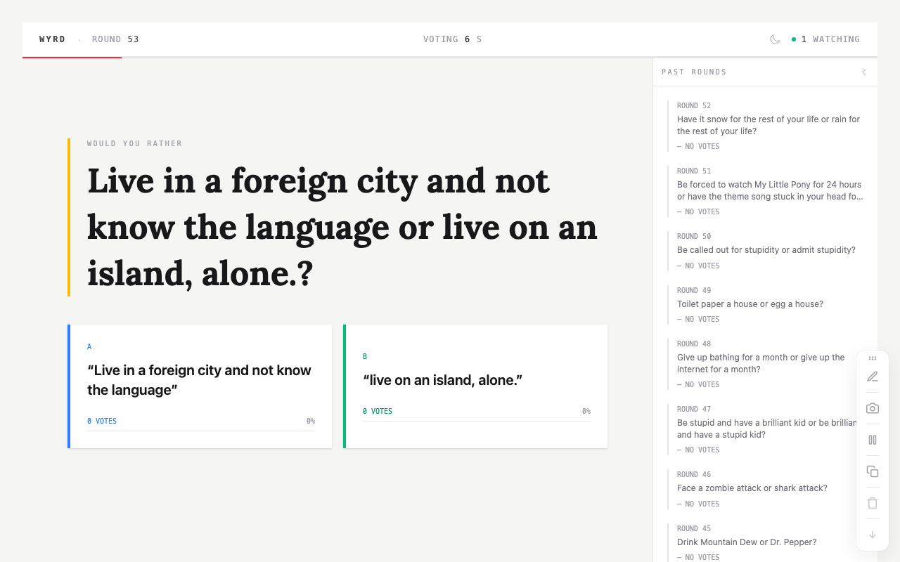

# Wyrd

A real-time "Would You Rather" voting game built with Laravel, Livewire 4, and broadcasting. Anonymous users vote on questions that auto-advance every 60 seconds, with live vote counts and viewer tracking synced across all connected browsers.

<p align="center">
  <picture>
    <source media="(prefers-color-scheme: dark)" srcset=".github/screenshots/vote-dark.png">
    <source media="(prefers-color-scheme: light)" srcset=".github/screenshots/vote-light.png">
    
  </picture>
</p>

## How It Works

1. A "Would You Rather" question is fetched from an external API and displayed to all connected users
2. Anyone can vote for Option A or Option B — no account required (votes are tracked by IP hash)
3. Vote counts and percentages update in real-time across all browsers via WebSocket events
4. After 60 seconds, the question auto-advances and a new round begins
5. Past rounds and their results are shown in a collapsible sidebar

### Real-Time Architecture

The app uses Laravel's event broadcasting with two key events:

- **`VoteUpdated`** — broadcast whenever someone votes, instantly updating totals for all viewers
- **`QuestionAdvanced`** — broadcast when the timer expires, triggering all clients to load the new question

A cache lock prevents race conditions when multiple users trigger question advancement simultaneously. Active viewer count is tracked via Redis cache with 90-second TTL, polled every 30 seconds.

## Stack

- **Laravel 12** with PHP 8.4+
- **Livewire 4** single-file components with `#[On('echo:...')]` listeners
- **Livewire Flux Pro** for UI components
- **Alpine.js** for client-side countdown timer and dark mode toggle
- **Tailwind CSS v4** with full dark mode support
- **SQLite** database
- **Laravel Echo** + WebSocket broadcasting for real-time sync

## Installation

```bash
git clone https://github.com/joshcirre/wyrd.git
cd wyrd
composer setup
```

The `composer setup` command handles dependency installation, environment config, database creation, migrations, and asset building.

## Development

```bash
composer run dev       # Start server, queue, logs, and Vite
```

### Code Quality

```bash
composer fix           # Fix everything: types, refactoring, formatting
composer test          # Run all checks: typos, tests, linting, types, refactoring
```

| Command              | Purpose                                              |
| -------------------- | ---------------------------------------------------- |
| `composer test:unit` | Pest tests (parallel)                                |
| `composer test:types`| PHPStan analysis (max level)                         |
| `composer test:lint` | Check formatting (Pint + Prettier)                   |
| `composer test:refactor` | Rector dry-run                                   |

## Flux Pro License

A [Flux Pro](https://fluxui.dev) license is required. The app uses Flux components for icons, cards, and UI elements. Configure your credentials during `composer setup` or manually:

```bash
composer config http-basic.composer.fluxui.dev your-email your-license-key
```

## License

Open-sourced software licensed under the [MIT license](https://opensource.org/licenses/MIT).
